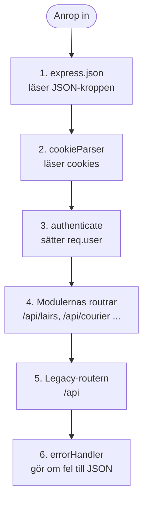

# 4.3 Ett anrops resa genom app.ts

```mermaid
flowchart TB
    req([Anrop in]) --> json[1. express.json<br/>läser JSON-kroppen]
    json --> cookie[2. cookieParser<br/>läser cookies]
    cookie --> auth[3. authenticate<br/>sätter req.user]
    auth --> mod[4. Modulernas routrar<br/>/api/lairs, /api/courier ...]
    mod --> legacy[5. Legacy-routern<br/>/api]
    legacy --> err[6. errorHandler<br/>gör om fel till JSON]
```
